# 🧱 Arquiteturas de Software — Linha Evolutiva

A **arquitetura de software** define como os componentes de um sistema se organizam, interagem e evoluem.  
Cada estilo arquitetural resolve **problemas específicos** de complexidade, escalabilidade, manutenção e desempenho.  

Abaixo estão os principais modelos, em ordem **histórica e evolutiva** — do **monólito** até as **arquiteturas modernas em nuvem**.  

---

## 🏗️ 1. Arquitetura Monolítica

### 💡 Descrição
É o modelo mais tradicional, onde **toda a aplicação é construída e implantada como um único bloco**.  
Todas as camadas (apresentação, lógica de negócio e persistência) estão dentro do mesmo código e deploy.

### ⚙️ Exemplo
Uma aplicação Spring Boot única (`algafood-api.jar`) com pacotes:

com.algaworks.algafood.api
com.algaworks.algafood.domain
com.algaworks.algafood.infrastructure

### ✅ Vantagens
- Simples de desenvolver e implantar  
- Baixo custo inicial  
- Ideal para MVPs e sistemas pequenos  

### ⚠️ Desvantagens
- Dificuldade de escalar partes específicas  
- Deploy único (um erro afeta tudo)  
- Manutenção complexa a longo prazo  

---

## 🧱 2. Arquitetura em Camadas (Layered Architecture)

### 💡 Descrição
Divide o sistema em **camadas horizontais** com responsabilidades bem definidas.  
É o padrão mais comum em aplicações corporativas Java (Controller, Service, Repository).

### ⚙️ Exemplo
controller → service → repository → database

### ✅ Vantagens
- Organização clara e modular  
- Separação de responsabilidades  
- Base para arquiteturas mais avançadas  

### ⚠️ Desvantagens
- Escalabilidade limitada  
- Pode gerar acoplamento entre camadas  

---

## 🧩 3. Arquitetura Modular (Modular Monolith)

### 💡 Descrição
Uma evolução do monólito tradicional.  
O sistema continua único, mas dividido em **módulos independentes** por domínio de negócio.

### ⚙️ Exemplo
core/  
pedido/  
pagamento/  
cliente/  

### ✅ Vantagens
- Simplicidade do monólito com melhor organização  
- Facilita evolução para microsserviços  
- Build e deploy únicos  

### ⚠️ Desvantagens
- Ainda há dependência entre módulos  
- Escalabilidade limitada  

---

## 🧭 4. Arquitetura Orientada a Serviços (SOA)

### 💡 Descrição
Divisão do sistema em **serviços corporativos reutilizáveis**, geralmente conectados por um **barramento (ESB)**.  
Foi o precursor direto dos microsserviços modernos.

### ⚙️ Exemplo
Serviço de Pagamento ↔ ESB ↔ Serviço de Faturamento

### ✅ Vantagens
- Reuso entre sistemas  
- Integração com sistemas legados  

### ⚠️ Desvantagens
- Forte acoplamento com o barramento  
- Dificuldade de escalar individualmente  

---

## ☁️ 5. Arquitetura de Microsserviços

### 💡 Descrição
Divide a aplicação em **serviços pequenos, autônomos e independentes**, cada um com sua responsabilidade e banco de dados.  
A comunicação ocorre via **REST APIs** ou **mensageria** (Kafka, RabbitMQ).

### ⚙️ Exemplo
pedido-service/  
pagamento-service/  
notificacao-service/  

### ✅ Vantagens
- Escalabilidade e deploy independentes  
- Alta resiliência e isolamento de falhas  

### ⚠️ Desvantagens
- Maior complexidade de infraestrutura  
- Comunicação e monitoramento exigem ferramentas robustas  

---

## 🔄 6. Arquitetura Orientada a Eventos (Event-Driven Architecture)

### 💡 Descrição
Os serviços se comunicam de forma **assíncrona**, reagindo a **eventos publicados** em um broker de mensageria.  
Excelente para sistemas distribuídos e reativos.

### ⚙️ Exemplo
PedidoService → publica "PagamentoConfirmado"
EntregaService → consome evento e processa entrega

### ✅ Vantagens
- Desacoplamento entre serviços  
- Alta performance e escalabilidade  

### ⚠️ Desvantagens
- Fluxo difícil de rastrear  
- Maior complexidade de observabilidade  

---

## 🧠 7. Arquitetura Hexagonal (Ports and Adapters)

### 💡 Descrição
Proposta por **Alistair Cockburn**, separa o **núcleo de negócio (domain)** da **infraestrutura (banco, API, UI)**.  
A comunicação ocorre por **ports (interfaces)** e **adapters (implementações concretas)**.

### ⚙️ Estrutura típica
core/  
├── domain/  
├── ports/  
│ ├── input/  
│ └── output/  
adapters/  
├── inbound/ (controllers)  
└── outbound/ (repositories, APIs)  


### ✅ Vantagens
- Domínio independente de frameworks  
- Código mais testável e flexível  

### ⚠️ Desvantagens
- Estrutura inicial mais complexa  
- Curva de aprendizado mais alta  

---

## 🧼 8. Arquitetura Limpa (Clean Architecture)

### 💡 Descrição
Criada por **Robert C. Martin (Uncle Bob)**.  
Organiza o sistema em **camadas concêntricas**, onde o domínio está no centro e não depende de frameworks ou banco.

### ⚙️ Estrutura
entities/ → Regras de negócio
usecases/ → Casos de uso
adapters/ → Controladores e gateways
frameworks/ → Banco, API, mensageria

### ✅ Vantagens
- Altamente modular e testável  
- Independente de tecnologias externas  

### ⚠️ Desvantagens
- Sobrecarga inicial em projetos pequenos  
- Exige forte disciplina arquitetural  

---

## 🧅 9. Arquitetura Onion (Cebola)

### 💡 Descrição
Semelhante à Clean, reforça a **dependência do domínio como núcleo central**.  
As camadas externas (infra, UI) dependem das internas, nunca o contrário.

### ✅ Vantagens
- Independência tecnológica  
- Alta coesão e testabilidade  

### ⚠️ Desvantagens
- Estrutura complexa para sistemas pequenos  

---

## 🪶 10. Arquitetura Serverless

### 💡 Descrição
Aplicações compostas por **funções sob demanda** executadas na nuvem, sem necessidade de gerenciar servidores.

### ⚙️ Exemplo
AWS Lambda + API Gateway + DynamoDB

### ✅ Vantagens
- Escalabilidade automática  
- Pagamento por uso  
- Menos manutenção de infraestrutura  

### ⚠️ Desvantagens
- Dificuldade de testes locais  
- Possível latência (cold start)  

---

## 🧮 11. Arquitetura CQRS (Command Query Responsibility Segregation)

### 💡 Descrição
Separa os modelos de **leitura e escrita** em estruturas distintas, melhorando performance e escalabilidade.

### ✅ Vantagens
- Alta performance de leitura  
- Facilita event sourcing  

### ⚠️ Desvantagens
- Complexidade maior no design  
- Dificuldade de sincronização  

---

## 🔌 12. Arquitetura Orientada a Plugins

### 💡 Descrição
Permite adicionar ou remover funcionalidades sem alterar o núcleo principal da aplicação.

### ⚙️ Exemplo
core/  
plugins/  
├── analytics/  
├── notificacoes/  
└── relatorios/  

### ✅ Vantagens
- Extensível e modular  
- Ideal para sistemas customizáveis  

### ⚠️ Desvantagens
- Gerenciamento de dependências mais complexo  

---

## 🧩 13. Arquitetura de Microsserviços Modular

### 💡 Descrição
Combina modularização interna com microsserviços.  
Cada módulo pode evoluir até se tornar um serviço independente.

### ✅ Vantagens
- Evolução gradual e organizada  
- Boa governança entre domínios  

### ⚠️ Desvantagens
- Requer padronização entre módulos  

---

## 🧮 14. Arquitetura Baseada em Componentes (Component-Based)

### 💡 Descrição
Foca na criação de **componentes reutilizáveis e independentes**, ideais para aplicações distribuídas e modernas.

### ✅ Vantagens
- Reuso e flexibilidade  
- Facilita manutenção modular  

### ⚠️ Desvantagens
- Maior esforço de orquestração  

---

## 🧭 Linha Evolutiva das Arquiteturas

```mermaid
flowchart LR
    A[🏗️ Monolítica] --> B[🧱 Em Camadas]
    B --> C[🧩 Modular Monolith]
    C --> D[🧭 SOA]
    D --> E[☁️ Microsserviços]
    E --> F[🔄 Event-Driven]
    F --> G[🧠 Hexagonal]
    G --> H[🧼 Clean Architecture]
    H --> I[🧅 Onion]
    I --> J[🪶 Serverless]
    J --> K[🧮 CQRS]
    K --> L[🔌 Plugins]
    L --> M[🧩 Microsserviços Modular]
    M --> N[🧮 Component-Based]
```



## 📊 Tabela Comparativa das Arquiteturas

| **Arquitetura** | **Tipo** | **Escalabilidade** | **Complexidade** | **Ideal para** |
|------------------|-----------|--------------------|------------------|----------------|
| 🏗️ **Monolítica** | Local | 🔸 Baixa | 🟢 Baixa | MVPs e sistemas simples |
| 🧱 **Em Camadas** | Local | 🔸 Média | 🟢 Média | APIs corporativas |
| 🧩 **Modular Monolith** | Local | 🔸 Média | 🟡 Média | Sistemas médios/grandes |
| 🧭 **SOA** | Distribuída | 🔸 Média | 🟠 Alta | Integrações corporativas |
| ☁️ **Microsserviços** | Distribuída | 🔸 Muito Alta | 🔴 Alta | Sistemas escaláveis |
| 🔄 **Event-Driven** | Distribuída | 🔸 Muito Alta | 🔴 Alta | Sistemas reativos |
| 🧠 **Hexagonal** | Local | 🔸 Alta | 🟠 Alta | Projetos orientados a domínio |
| 🧼 **Clean Architecture** | Local | 🔸 Alta | 🔴 Alta | Produtos de longo prazo |
| 🧅 **Onion** | Local | 🔸 Alta | 🔴 Alta | Sistemas corporativos complexos |
| 🪶 **Serverless** | Nuvem | 🔸 Alta | 🟡 Média | Automação e APIs simples |
| ⚙️ **CQRS** | Híbrida | 🔸 Muito Alta | 🔴 Alta | Sistemas de alta performance |
| 🔌 **Plugins** | Local | 🔸 Média | 🟠 Média | Softwares extensíveis |
| 🧩 **Microsserviços Modular** | Distribuída | 🔸 Alta | 🟠 Média/Alta | Evolução controlada de sistemas |
| 🧮 **Component-Based** | Distribuída | 🔸 Alta | 🟠 Média | Aplicações modernas e reusáveis |

---

## 📈 Gráfico Comparativo — Escalabilidade x Complexidade

```mermaid
xychart-beta
    title "Escalabilidade x Complexidade das Arquiteturas"
    x-axis [Baixa, Média, Alta, Muito Alta]
    y-axis "Complexidade" 0 --> 5
    bar [1,2,3,4] name="Monolítica"
    bar [2,2,3,4] name="Em Camadas"
    bar [3,3,3,4] name="Modular Monolith"
    bar [2,3,3,4] name="SOA"
    bar [4,5,5,5] name="Microsserviços"
    bar [4,5,5,5] name="Event-Driven"
    bar [3,4,4,4] name="Hexagonal"
    bar [4,5,5,5] name="Clean Architecture"
    bar [4,5,5,5] name="Onion"
    bar [4,3,4,4] name="Serverless"
    bar [4,5,5,5] name="CQRS"
    bar [3,3,3,4] name="Plugins"
    bar [4,4,4,5] name="Microsserviços Modular"
    bar [4,4,4,4] name="Component-Based"
```

## 💬 Conclusão

A escolha da **arquitetura de software** deve considerar o **contexto do projeto**, a **maturidade da equipe** e a **escala do sistema**.

- 🧱 **Monólitos e camadas** funcionam bem em sistemas menores.  
- 🧩 **Clean, Hexagonal e Modular** são ideais para aplicações de médio porte.  
- ☁️ **Microsserviços, Event-Driven e Serverless** brilham em sistemas distribuídos e escaláveis.  

> 🧠 **“A melhor arquitetura não é a mais complexa — é a que torna o sistema fácil de evoluir.”**

